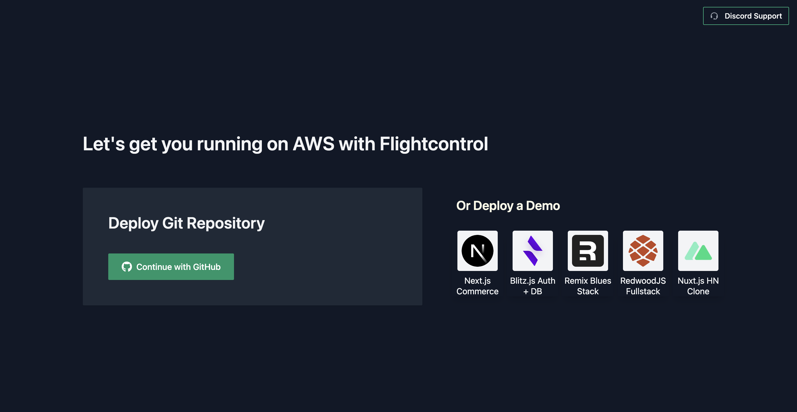
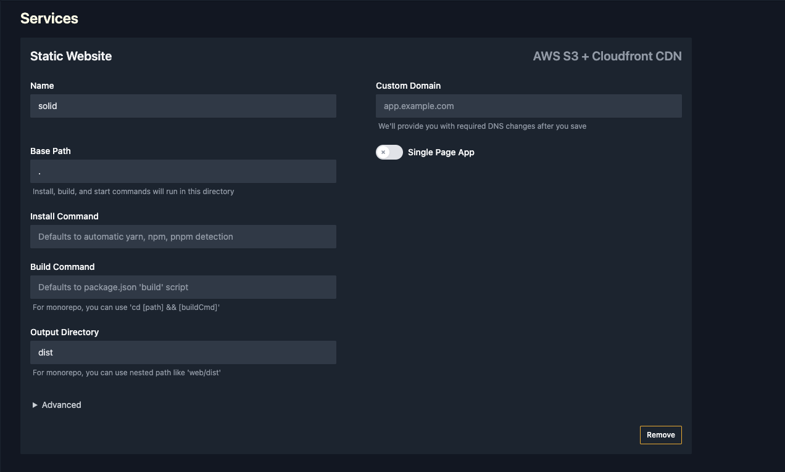
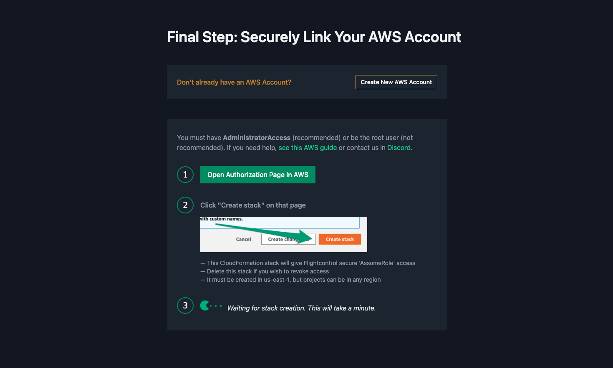

# Развертывание в AWS с помощью Flightcontrol

Здесь мы будем использовать [Flightcontrol](https://www.flightcontrol.dev/?ref=solid) для развертывания нашего проекта Solid.

Если вы еще не слышали о Flightcontrol, то это платформа, полностью автоматизирующая развертывание на Amazon Web Services (AWS). Более подробную информацию о Flightcontrol и ее возможностях можно найти на сайте [flightcontrol.dev](https://www.flightcontrol.dev/?ref=solid).

## Соединение Flightcontrol с вашим онлайн-репозиторием Git

С помощью Flightcontrol можно использовать возможности GitHub по непрерывной разработке. При подключении Flightcontrol к репозиторию GitHub не требуется никакой дополнительной настройки.

Flightcontrol автоматически обнаруживает пуши в указанную ветку и собирает проект на основе команд, указанных в `package.json`, и настроек в настройках сборки Flightcontrol.

Ниже приводится краткое пошаговое руководство по работе с онлайн-репо Solid на Flightcontrol.

**Шаг 1:** Войдите или зарегистрируйтесь на Flightcontrol.

**Шаг 2:** Подключите свой аккаунт Github к Flightcontrol.



!!!note ""

    Для получения дополнительной информации о том, как подключить учетную запись github, посетите [Connecting GitHub Accounts to Flightcontrol](https://www.flightcontrol.dev/docs/getting-started/connecting-github?ref=solid)

## Вариант 1: Использование Dashboard

**Шаг 1:** Создайте проект Flightcontrol в Dashboard. Выберите репозиторий для исходного кода.

**Шаг 2:** Выберите тип GUI-конфигурации.

**Шаг 3:** Добавьте сервис статического сайта, нажав на опцию `Add a Static Site`.


**Шаг 4:** Добавьте выходной каталог `dist`.

**Шаг 5:** Добавьте все переменные окружения, которые могут понадобиться проекту.



**Шаг 6:** Подключите свой аккаунт AWS.



**Шаг 7:** Отправьте форму нового проекта.

## Вариант 2: Использование кода

Используйте конфигурацию `flightcontrol.json` для проекта

**Шаг 1:** Создайте проект Flightcontrol на панели управления. Выберите репозиторий для исходного кода.

**Шаг 2:** Выберите тип конфигурации `flightcontrol.json`.


**Шаг 3:** Добавьте в корень вашего репозитория новый файл `flightcontrol.json`. Вот пример конфигурации, создающей сервис статических сайтов для приложения Solid:

```json
{
    "$schema": "https://app.flightcontrol.dev/schema.json",
    "environments": [
        {
            "id": "production",
            "name": "Production",
            "region": "us-west-2",
            "source": {
                "branch": "main"
            },
            "services": [
                {
                    "id": "my-static-solid",
                    "buildType": "nixpacks",
                    "name": "My static solid site",
                    "type": "static",
                    "domain": "solid.yourapp.com",
                    "outputDirectory": "dist",
                    "singlePageApp": true
                }
            ]
        }
    ]
}
```

!!!note ""

    Более подробную информацию, инструкции по сборке и развертыванию, а также описание возможностей можно найти на сайте [Flightcontrol documentation](https://www.flightcontrol.dev/docs?ref=solid)

## Ссылки

-   [Deploying to AWS via Flightcontrol](https://docs.solidjs.com/guides/how-to-guides/deployment/deploying-to-flightcontrol)
