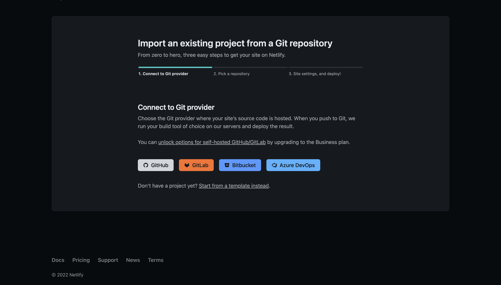

# Развертывание в Netlify

Здесь мы будем использовать [Netlify](https://netlify.com) для развертывания нашего проекта Solid.

Если вы еще не слышали о Netlify, то это платформа, на которой разработчики могут размещать свои проекты, будь то веб-сайты, API и т.д. Для получения более подробной информации о Netlify и предлагаемых ею возможностях обязательно посетите их [сайт](https://netlify.com).

## Соединение Netlify с вашим онлайн-репозиторием Git

С помощью Netlify вы можете использовать возможности GitHub по непрерывной разработке. При подключении Netlify к вашему репозиторию GitHub не требуется никакой дополнительной настройки для размещения и обновления сайта на Netlify. Netlify автоматически обнаруживает пуши в указанную ветку и собирает проект на основе команд, указанных в `package.json`, и настроек в настройках сборки Netlify.

Вот краткое пошаговое руководство по установке и запуску кода из онлайн-репо Solid в Netlify.

**Примечание:** В качестве примера мы будем использовать GitHub. Однако вы можете использовать и другие онлайн-провайдеры git.

**Шаг 1:** Войдите или зарегистрируйтесь на Netlify, используя свою учетную запись GitHub. Войти или создать учетную запись можно [здесь](https://app.netlify.com).

**Шаг 2:** После входа или регистрации приборная панель должна выглядеть примерно так.


Нажмите на кнопку `Добавить новый сайт`, чтобы добавить ваш новый проект Solid.

**Шаг 3:** Подключите ваш Git-провайдер к Netlify, чтобы увидеть список ваших репозиториев, которые могут быть развернуты в Netlify.



После выбора Git-провайдера и проекта, который вы хотите развернуть, давайте настроим параметры сборки, которые находятся в настройках сайта, как показано на следующем шаге.

**Шаг 4:** Экран настроек сайта должен выглядеть следующим образом


Единственная настройка, которую нам нужно изменить, это значение `publish directory`, его нужно изменить с `netlify` на `dist`, так как именно туда Solid помещает конечные файлы сборки.

После этого просто нажмите кнопку deploy и подождите несколько минут, пока сайт соберется, и все готово!

## Использование Netlify CLI

**Шаг 1:** Установите Netlify CLI с помощью pnpm, yarn или npm

```bash
npm i -g netlify-cli
# or
pnpm i -g netlify-cli
# or
yarn global add netlify-cli
```

!!!note ""

    Перед выполнением следующего шага убедитесь, что у вас настроена учетная запись Netlify и создана команда. Это поможет вам настроить проект и развернуть его.

**Шаг 2:** Выполните команду `netlify init` в каталоге проекта и войдите в систему, используя любой из поддерживаемых вариантов входа (например, GitHub).

```bash
netlify init
```

Следуйте инструкциям, выдаваемым инструментом командной строки.

!!!note "Примечание"

    Убедитесь, что в подсказке `Directory to deploy (blank for current dir):` установлено значение `dist`, поскольку именно туда Solid по умолчанию помещает собранные файлы проекта.

После того как вы ответите на все запросы, выдаваемые CLI, вы должны увидеть следующее сообщение, свидетельствующее об успешной настройке проекта.


!!!note ""

    Более подробную информацию и инструкции по сборке и развертыванию, а также описание возможностей можно найти в [документации Netlify](https://docs.netlify.com/).

## Ссылки

-   [Deploying To Netlify](https://docs.solidjs.com/guides/how-to-guides/deployment/deploying-to-netlify)
