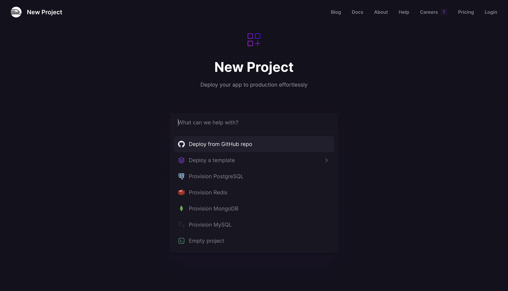
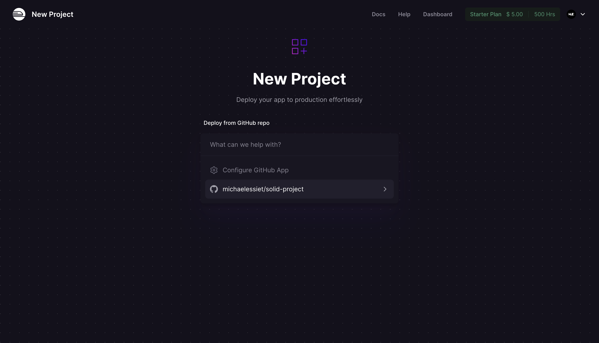
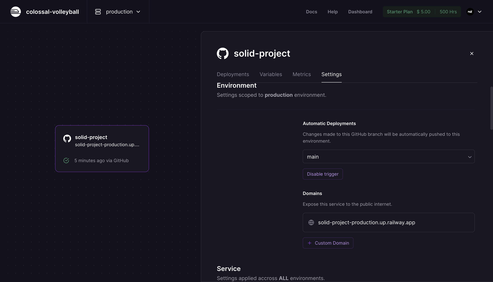

# Развертывание на Railway

Здесь мы будем использовать [Railway](https://railway.app) для развертывания нашего проекта Solid.

Если вы еще не слышали о Railway, то это платформа, на которой разработчики могут размещать свои веб-проекты в облаке. Для получения более подробной информации о Railway и о том, что они предлагают, обязательно посетите их [сайт](https://railway.app).

## Первый шаг: Изменение команды Start

При использовании Railway нам потребуется использовать другую команду `start` в файле `package.json`. Вместо `vite` мы должны использовать `npx http-server ./dist`. Как вы заметили, для получения папки `dist` нам придется собрать приложение в правильном порядке, поэтому при локальной разработке лучше использовать неотредактированную команду `dev`, а команду `start` оставить для использования при развертывании на Railway. Вот краткий обзор того, как это может выглядеть в вашем `package.json`.

```diff
...
  "scripts": {
-  "start": "vite"
+  "start": "npx http-server ./dist",
    "dev": "vite",
    "build": "vite build",
    "serve": "vite preview",
    "predeploy": "npm run build",
    "deploy": "gh-pages -d build"
  },
...
```

После этого можно приступать к работе. Давайте перейдем на сайт [Railway](https://railway.app/)

## Связь Railway с вашим онлайн-репозиторием Git

Railway позволяет нам использовать действия непрерывной интеграции GitHub. При подключении Railway к репозиторию GitHub не требуется дополнительной настройки, если только вы не хотите использовать переменные окружения и изменять команды сборки проекта. Railway способен автоматически определять коммиты в ту ветку, которую вы указали для развертывания.

**Примечание:** В качестве примера мы будем использовать GitHub.

**Шаг 1:** Войдите или зарегистрируйтесь на сайте Railway, используя свою учетную запись GitHub. Регистрация на Railway довольно проста: как только вы попадете на их [домашнюю страницу](https://railway.app), щелкните на `Start a New Project`, и вы окажетесь на странице подключения к GitHub. Страница должна выглядеть примерно так



После выбора GitHub вы будете перенаправлены на GitHub для авторизации Railway.

**Шаг 2:** После авторизации Railway для установки в ваши репозитории вы будете перенаправлены обратно на сайт Railway, где сможете выбрать репозиторий, содержащий ваш проект Solid. Экран должен выглядеть примерно так



После выбора репозитория, содержащего проект Solid, можно нажать кнопку `Deploy Now` или добавить переменные окружения, которые может использовать ваше приложение.

**Шаг 3:** После того как все это сделано, остается только дождаться успешной сборки и развертывания. Если развертывание прошло без каких-либо заминок, вы должны увидеть следующее окно.


Как вы могли заметить, домен не будет автоматически назначен проекту после развертывания. В случае с Railway вам придется зайти в настройки и вручную сгенерировать домен. Вот как это выглядит



И вуаля, ваш новый проект Solid должен быть развернут на сгенерированном домене и готов к работе.

## Использование Railway CLI

**Шаг 1:** Установите Railway CLI с помощью pnpm, yarn или npm

```bash
npm i -g @railway/cli
# or
pnpm i -g @railway/cli
# or
yarn global add @railway/cli
```

**Шаг 2:** Войдите в систему Railway с помощью интерфейса Railway CLI

```bash
railway login
```

**Шаг 3:** Вы можете связать локальный проект Solid с уже существующим проектом Railway с помощью команды `railway link` или создать новый проект Railway с помощью команды `railway init` и ответить на появившиеся в терминале командные подсказки.

**Шаг 4:** После этого можно развернуть проект в Railway с помощью следующей команды

```bash
railway up
# or
railway up --detach # if you don't want to see the logs outputted
```

И вуаля, ваш проект запущен и готов к работе!

!!!note ""

    Более подробную информацию о том, как использовать Railway для развертывания проекта, можно найти на сайте [документация](https://docs.railway.app).

## Ссылки

-   [Deploying To Railway](https://docs.solidjs.com/guides/how-to-guides/deployment/deploying-to-railway)
