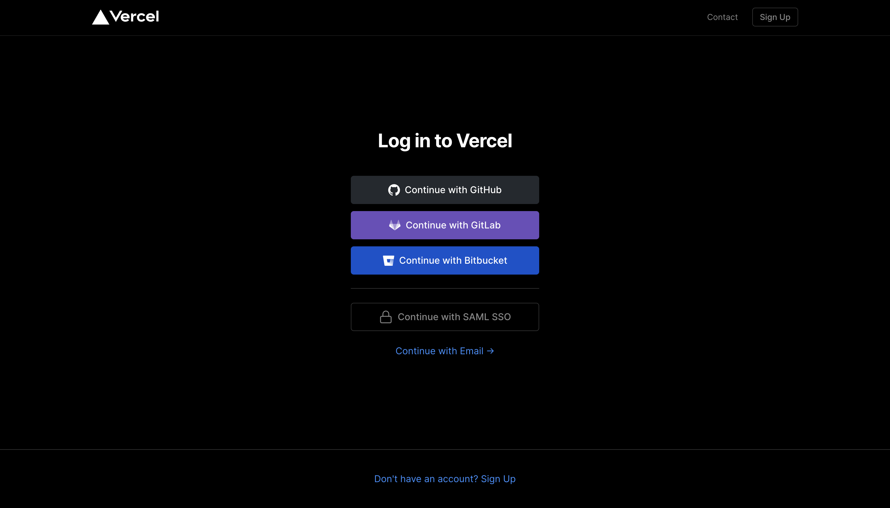
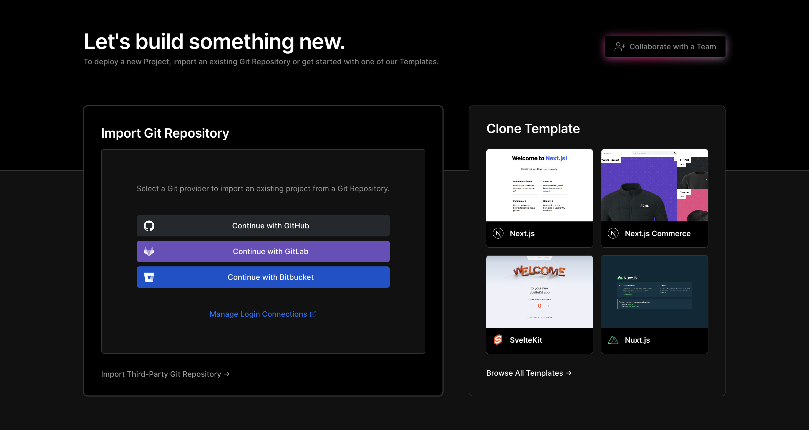
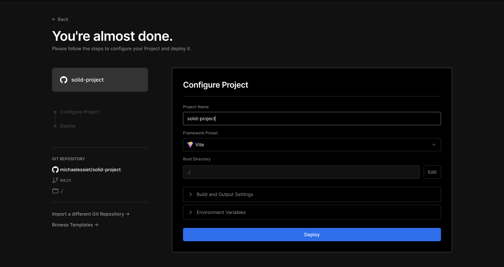
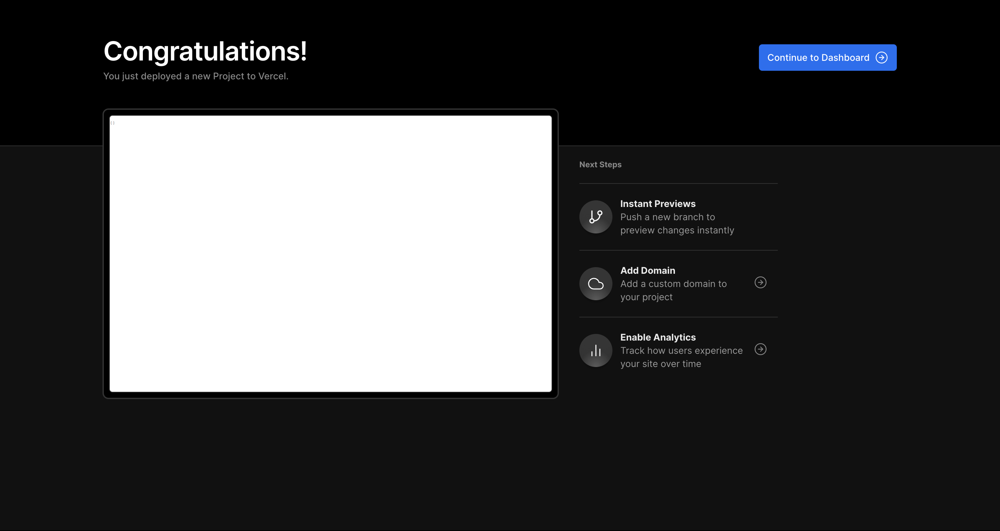

# Развертывание на Vercel

Здесь мы будем использовать [Vercel](https://vercel.com/home) для развертывания нашего проекта Solid.

Если вы еще не слышали о Vercel, то это платформа, на которой разработчики могут размещать свои фронтенд-проекты. Для получения более подробной информации о Vercel и о том, чем она занимается, обязательно посетите их [сайт](https://vercel.com/home).

## Соединение Vercel с вашим онлайн-репозиторием Git

С помощью Vercel можно использовать действия непрерывной интеграции GitHub. При подключении Vercel к репозиторию GitHub не требуется дополнительных настроек для размещения и обновления сайта на Vercel, Vercel автоматически обнаруживает пуши в указанную ветку и собирает проект, основываясь на командах, указанных в `package.json`.

Ниже приводится краткое пошаговое руководство по созданию и запуску онлайн-репо Solid на Vercel

**Примечание:** В качестве примера мы будем использовать GitHub.

**Шаг 1:** Войдите или зарегистрируйтесь на Vercel, используя свою учетную запись GitHub. Страница входа должна выглядеть примерно так.



**Шаг 2:** Добавьте новый проект в свою учетную запись Vercel. После входа в систему вы будете перенаправлены на приборную панель. На этой панели нажмите на кнопку в правом верхнем углу и выберите `Add New Project`.

После этого вы будете перенаправлены на страницу, которая выглядит следующим образом



Выберите `Continue with GitHub`, но не стесняйтесь использовать любой другой сервис онлайн-репозиториев, который вы используете и который также предлагается здесь.

**Шаг 3:** Далее должен появиться список ваших репозиториев, если его нет, то можно воспользоваться строкой поиска.

Выбрав репозиторий, просто нажмите на кнопку `import`.

**Завершающий шаг:** После импорта репозитория проекта Solid вы будете перенаправлены на следующее окно



Просто нажмите кнопку развернуть, и все готово. Если у вас есть какие-либо переменные окружения, обязательно добавьте их в поле переменных окружения.

После завершения сборки и развертывания вы будете перенаправлены на экран, который выглядит следующим образом. Квадрат слева будет представлять собой скриншот вашего сайта.



Щелчок на сгенерированном изображении приведет вас на ваш живой сайт Solid.

## Использование Vercel CLI

**Шаг 1:** Установите Vercel CLI с помощью pnpm, yarn или npm

```bash
npm i -g vercel
# or
pnpm i -g vercel
# or
yarn global add vercel
```

**Шаг 2:** Запустите команду `vercel` в каталоге проекта и войдите в систему, используя любой из поддерживаемых вариантов входа

```bash
vercel
```

Следуйте инструкциям, предлагаемым инструментом командной строки. После этого ваш проект должен быть развернут в Vercel. (например, `solid.vercel.app`)

Дополнительную информацию, инструкции по сборке и развертыванию, а также описание возможностей можно найти в [документации Vercel](https://vercel.com/docs).

## Ссылки

-   [Deploying To Vercel](https://docs.solidjs.com/guides/how-to-guides/deployment/deploying-to-vercel)
