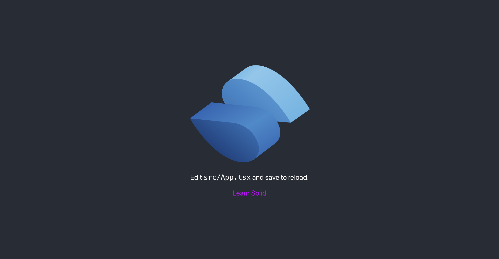
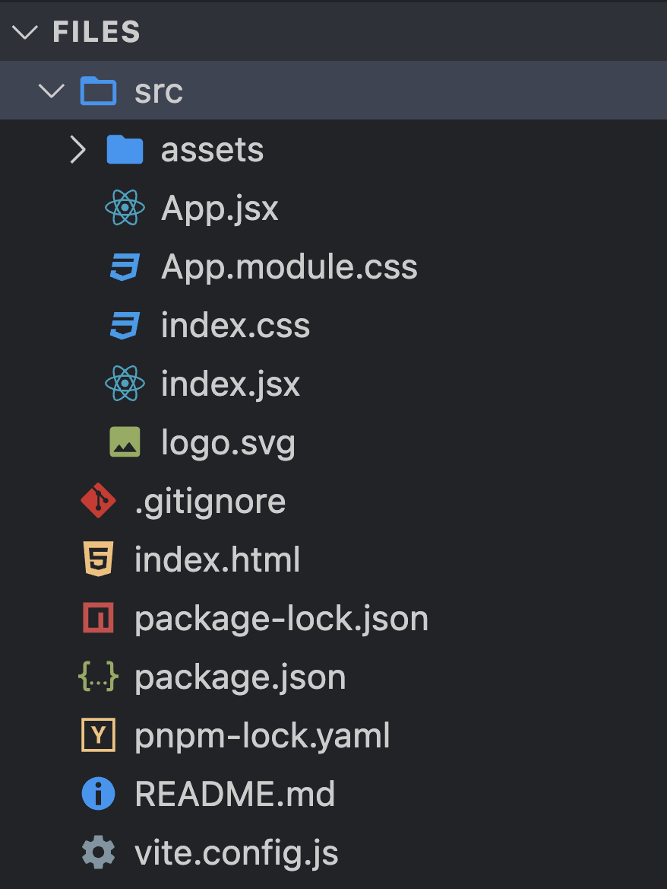
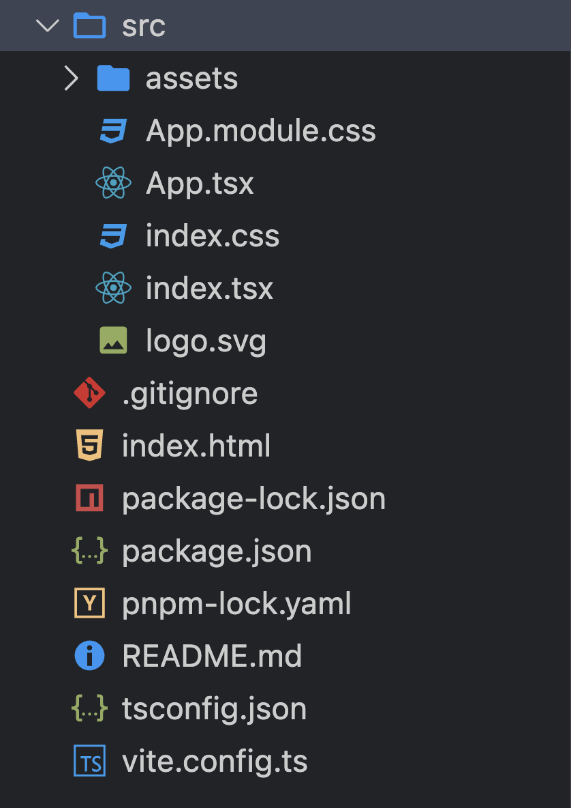

# Установка Solid

Вы можете работать с Solid, используя браузерный редактор, или установить его локально на свой компьютер.

## В браузере

Самый простой способ начать работу с Solid - это выбрать браузерный вариант.

-   **StackBlitz Starters**: Stackblitz - это веб-среда разработки. Вы можете выбрать [JavaScript starter](https://stackblitz.com/github/solidjs/templates/tree/master/js) или [TypeScript starter](https://stackblitz.com/github/solidjs/templates/tree/master/ts). По этим ссылкам будет создана полная среда проекта, и все будет выполняться непосредственно в браузере.

## В локальном окружении

Чтобы запустить Solid на своем компьютере, убедитесь, что у вас установлен [Node.js](https://nodejs.org).
Затем выполните одну из этих команд, которые взяты из наших [Vite шаблонов](https://github.com/solidjs/templates).

### Шаблон JavaScript

```bash
npx degit solidjs/templates/js my-app
cd my-app
npm install # or yarn or pnpm
npm run dev # or yarn or pnpm
```

### Шаблон TypeScript

```bash
npx degit solidjs/templates/ts my-app
cd my-app
npm install # or yarn or pnpm
npm run dev # or yarn or pnpm
```

Если все установлено правильно, то последняя команда должна запустить демонстрационное приложение на порту 3000. Перейдите по адресу [https://localhost:3000](https://localhost:3000), и вы увидите следующее демонстрационное приложение:



## JavaScript vs TypeScript

Для данного урока не имеет значения, какой шаблон вы выберете - JavaScript или TypeScript. Если вы знаете TypeScript, смело выбирайте его. В шаблоне TypeScript файлы кода будут заканчиваться на `.ts` и `.tsx`, а не на `.js` и `.jsx`.

## Понимание структуры проекта

=== "JS"



=== "TS"



В этих шаблонах проект состоит из множества файлов, но разбираться в них сейчас не имеет смысла. Мы будем знакомить вас с файлами по мере их необходимости.
Пока же приведем основные:

-   Для выполнения нашего кода мы используем [Vite](https://vitejs.dev/). Vite - это инструмент, позволяющий импортировать один файл из другого и использовать плагины для улучшения процесса разработки. Когда мы готовы развернуть наше приложение, Vite упаковывает наш код.
    Файл `vite.config.ts` (`vite.config.js`) настраивает проект Vite.
-   Все, что мы будем делать в этом уроке, находится в папке `src`.
-   Начальной точкой нашего сайта является `index.html`. Он представляет собой базовый HTML-скелет и содержит ссылки на папки `src/index.tsx` (`src/index.jsx`).
-   `src/index.tsx` (`src/index.jsx`) является отправной точкой для нашего приложения Solid.
    Оно, в свою очередь, импортирует `src/App.tsx` (`src/App.jsx`), который является нашим первым компонентом. О компонентах мы поговорим далее!

## Ссылки

-   [Installing Solid](https://docs.solidjs.com/guides/tutorials/getting-started-with-solid/installing-solid)
